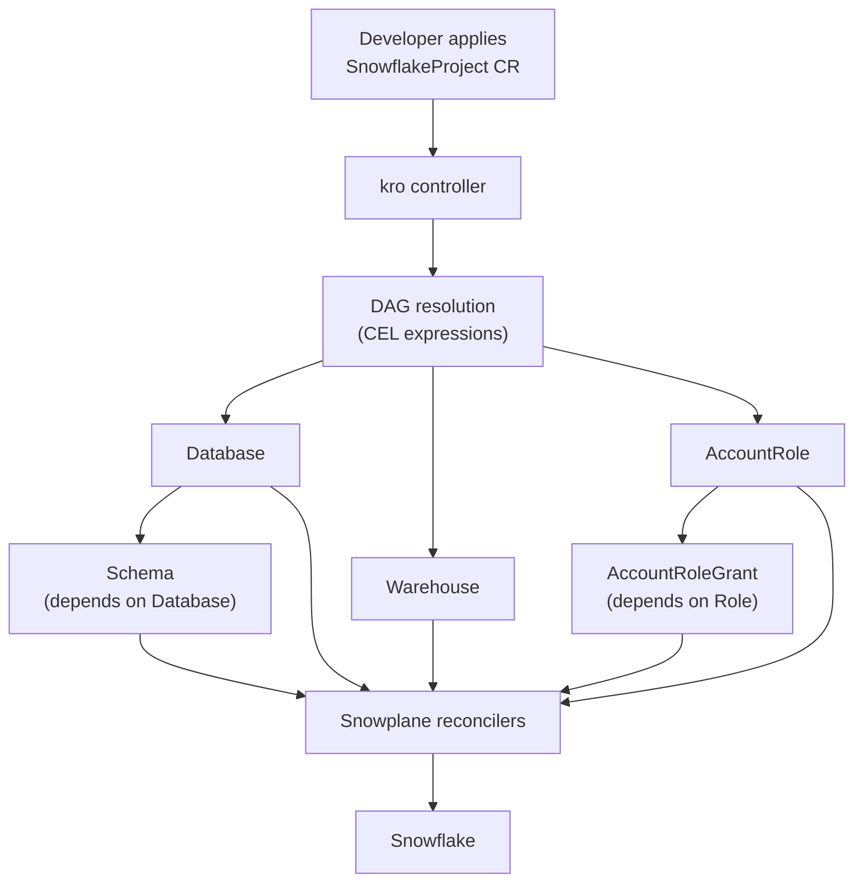

# kro (Kube Resource Orchestrator)
{: .fs-8 }

Create custom Kubernetes APIs that deploy groups of Snowplane resources as a single unit using [kro](https://kro.run).
{: .fs-5 .fw-300 }

---

## What is kro?

[kro](https://kro.run) is a Kubernetes-native project (kubernetes-sigs) that lets you define **ResourceGraphDefinitions** (RGDs) — declarative blueprints that bundle multiple resources into a single, reusable custom API. kro uses CEL expressions (the same language Snowplane uses for CRD validation) to wire values between resources and automatically determines the correct creation order via a DAG.

**Why use kro with Snowplane?**

| Concern | Without kro | With kro |
|:--------|:------------|:---------|
| Provisioning a full stack | Apply 5-10 individual CRs in order | Apply 1 custom resource |
| Dependency ordering | Manual `dependsOn` / sync waves | Automatic DAG resolution |
| Self-service | Developers need to know every CRD | Expose a simplified API |
| Standardisation | Copy-paste YAML across teams | Single RGD, many instances |
| Cleanup | Delete resources in reverse order | Delete one instance |

---

## Prerequisites

- kro installed in your cluster ([installation guide](https://kro.run/docs/getting-started/Installation))
- Snowplane operator running with a valid `ProviderConfig`

```bash
# Install kro
helm install kro oci://registry.k8s.io/kro/charts/kro \
  --namespace kro-system \
  --create-namespace

# Verify
kubectl get pods -n kro-system
```

---

## Example: Snowflake Project Stack

This RGD creates a reusable **SnowflakeProject** API that provisions a complete Snowflake project environment — Database, Schema, Warehouse, Role, and an access Grant — from a single custom resource.

### ResourceGraphDefinition

```yaml
apiVersion: kro.run/v1alpha1
kind: ResourceGraphDefinition
metadata:
  name: snowflake-project
spec:
  schema:
    apiVersion: v1alpha1
    kind: SnowflakeProject
    spec:
      name: string
      environment: string | default="dev"
      warehouseSize: string | default="XSMALL"
      retentionDays: integer | default=1
      providerConfigRef: string | default="default"
    status:
      databaseReady: ${database.status.conditions[?(@.type=="Ready")].status}
      warehouseReady: ${warehouse.status.conditions[?(@.type=="Ready")].status}

  resources:
    # 1. Database
    - id: database
      template:
        apiVersion: snowplane.hupe1980.github.io/v1alpha1
        kind: Database
        metadata:
          name: ${schema.spec.name}-${schema.spec.environment}-db
        spec:
          providerConfigRef:
            name: ${schema.spec.providerConfigRef}
          name: ${schema.spec.name}_${schema.spec.environment}
          dataRetentionTimeInDays: ${schema.spec.retentionDays}
          comment: "Managed by kro – project ${schema.spec.name}"

    # 2. Schema (depends on Database)
    - id: dbschema
      template:
        apiVersion: snowplane.hupe1980.github.io/v1alpha1
        kind: Schema
        metadata:
          name: ${schema.spec.name}-${schema.spec.environment}-schema
        spec:
          providerConfigRef:
            name: ${schema.spec.providerConfigRef}
          name: PUBLIC
          databaseRef:
            name: ${database.metadata.name}
          dataRetentionTimeInDays: ${schema.spec.retentionDays}

    # 3. Warehouse
    - id: warehouse
      template:
        apiVersion: snowplane.hupe1980.github.io/v1alpha1
        kind: Warehouse
        metadata:
          name: ${schema.spec.name}-${schema.spec.environment}-wh
        spec:
          providerConfigRef:
            name: ${schema.spec.providerConfigRef}
          name: ${schema.spec.name}_${schema.spec.environment}_WH
          warehouseSize: ${schema.spec.warehouseSize}
          autoSuspend: 60
          autoResume: true
          comment: "Managed by kro – project ${schema.spec.name}"

    # 4. Role
    - id: role
      template:
        apiVersion: snowplane.hupe1980.github.io/v1alpha1
        kind: AccountRole
        metadata:
          name: ${schema.spec.name}-${schema.spec.environment}-role
        spec:
          providerConfigRef:
            name: ${schema.spec.providerConfigRef}
          name: ${schema.spec.name}_${schema.spec.environment}_ROLE
          comment: "Managed by kro – project ${schema.spec.name}"

    # 5. Grant USAGE on Database to Role
    - id: grant
      template:
        apiVersion: snowplane.hupe1980.github.io/v1alpha1
        kind: AccountRoleGrant
        metadata:
          name: ${schema.spec.name}-${schema.spec.environment}-grant
        spec:
          providerConfigRef:
            name: ${schema.spec.providerConfigRef}
          roleName: ${schema.spec.name}_${schema.spec.environment}_ROLE
          privileges:
            - privilege: USAGE
              onDatabase: ${schema.spec.name}_${schema.spec.environment}
```

### Deploy the RGD

```bash
kubectl apply -f snowflake-project-rgd.yaml

# Verify — should show State: Active
kubectl get rgd snowflake-project -owide
```

### Create a Project Instance

```yaml
apiVersion: kro.run/v1alpha1
kind: SnowflakeProject
metadata:
  name: analytics
  namespace: data-team
spec:
  name: analytics
  environment: prod
  warehouseSize: MEDIUM
  retentionDays: 7
  providerConfigRef: default
```

```bash
kubectl apply -f analytics-project.yaml

# Watch all five resources come up together
kubectl get databases,schemas,warehouses,accountroles,accountrolegrants -n data-team
```

### Clean Up

Deleting the instance removes all managed resources in the correct order:

```bash
kubectl delete snowflakeproject analytics -n data-team
```

---

## Example: Data Pipeline Stack

A more advanced RGD that creates resources for a data pipeline — Stage, Pipe, Task, and a Stream — with conditional resource inclusion:

```yaml
apiVersion: kro.run/v1alpha1
kind: ResourceGraphDefinition
metadata:
  name: snowflake-pipeline
spec:
  schema:
    apiVersion: v1alpha1
    kind: SnowflakePipeline
    spec:
      name: string
      databaseRef: string
      schemaRef: string
      enableStream: boolean | default=false
      providerConfigRef: string | default="default"
    status:
      stageReady: ${stage.status.conditions[?(@.type=="Ready")].status}

  resources:
    - id: stage
      template:
        apiVersion: snowplane.hupe1980.github.io/v1alpha1
        kind: Stage
        metadata:
          name: ${schema.spec.name}-stage
        spec:
          providerConfigRef:
            name: ${schema.spec.providerConfigRef}
          name: ${schema.spec.name}_STAGE
          databaseRef:
            name: ${schema.spec.databaseRef}
          schemaRef:
            name: ${schema.spec.schemaRef}

    - id: stream
      includeWhen:
        - ${schema.spec.enableStream}
      template:
        apiVersion: snowplane.hupe1980.github.io/v1alpha1
        kind: Stream
        metadata:
          name: ${schema.spec.name}-stream
        spec:
          providerConfigRef:
            name: ${schema.spec.providerConfigRef}
          name: ${schema.spec.name}_STREAM
          databaseRef:
            name: ${schema.spec.databaseRef}
          schemaRef:
            name: ${schema.spec.schemaRef}
```

---

## How It Works



1. Developer applies a single **SnowflakeProject** (or any custom kind)
2. kro resolves CEL expressions and builds a DAG of dependencies
3. Resources are created in topological order — Database before Schema, Role before Grant
4. Snowplane reconcilers handle each resource independently
5. kro monitors all resources and reports aggregate status

---

## Tips

{: .tip }
> **ProviderConfig passthrough** — Thread `providerConfigRef` through the RGD schema so each instance can target a different Snowflake account.

{: .note }
> **Namespace isolation** — Each RGD instance lives in a namespace. Combine with Snowplane's namespace-scoped mode (`--namespace-scope`) for multi-tenant setups.

{: .important }
> **CRD ordering** — Snowplane CRDs must be installed before you create an RGD that references them. kro validates resource templates against the cluster's API schema at RGD creation time.

---

## Comparison with Other Approaches

| Approach | Dependency Management | Self-Service API | Drift Correction |
|:---------|:---------------------|:-----------------|:-----------------|
| **kro** | Automatic DAG | Yes (custom CRD) | kro + Snowplane |
| **Argo CD** | Sync waves / hooks | No | Argo + Snowplane |
| **Flux** | `dependsOn` | No | Flux + Snowplane |
| **Helm** | Template ordering | No | Manual |

kro is complementary to GitOps tools — you can manage RGD manifests and instances via Argo CD or Flux and get the best of both worlds.

---

## Further Reading

- [kro documentation](https://kro.run/docs/overview)
- [kro GitHub repository](https://github.com/kubernetes-sigs/kro)
- [ResourceGraphDefinition concepts](https://kro.run/docs/concepts/rgd/overview)
- [GitOps with Argo CD](gitops-argocd.md) — combine kro with Argo CD
- [GitOps with Flux](gitops-flux.md) — combine kro with Flux
