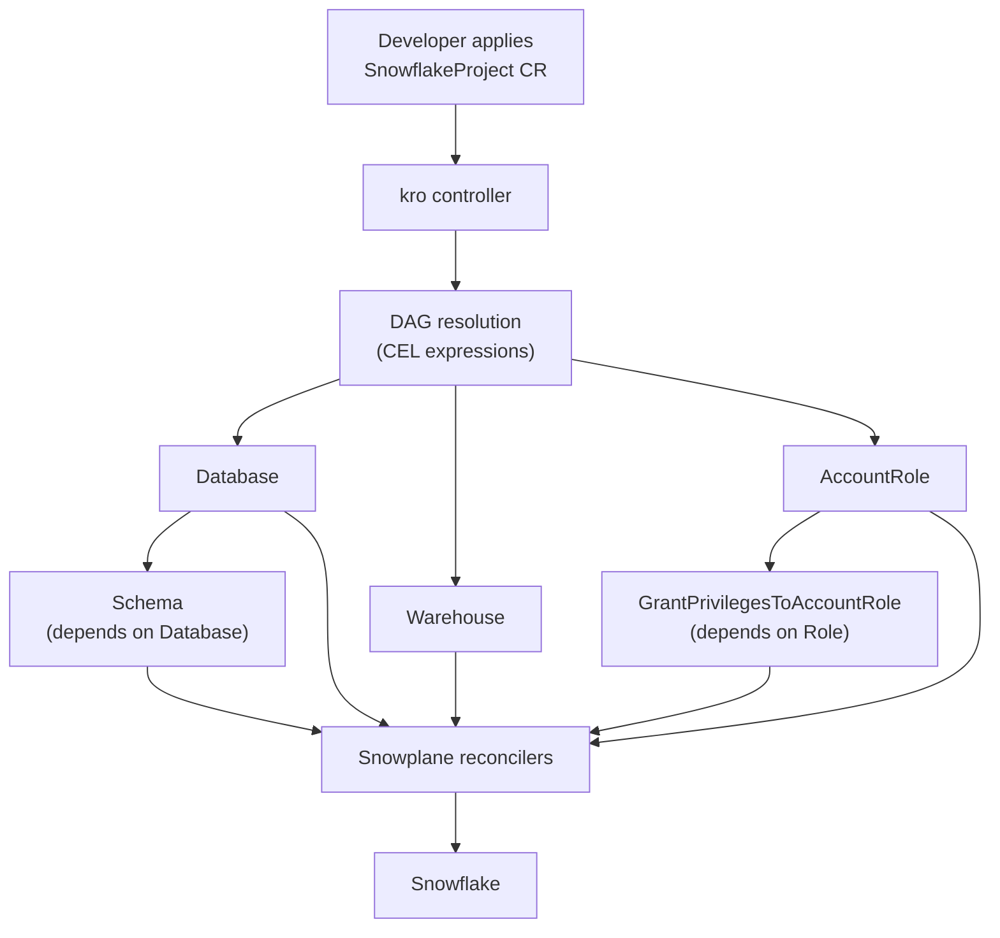

# kro (Kube Resource Orchestrator)
{: .fs-8 }

Create custom Kubernetes APIs that deploy groups of Snowplane resources as a single unit using [kro](https://kro.run).
{: .fs-5 .fw-300 }

---

## What is kro?

[kro](https://kro.run) is a Kubernetes-native project (kubernetes-sigs) that lets you define **ResourceGraphDefinitions** (RGDs) — declarative blueprints that bundle multiple resources into a single, reusable custom API. kro uses CEL expressions (the same language Snowplane uses for CRD validation) to wire values between resources and automatically determines the correct creation order via a DAG.

**Why use kro with Snowplane?**

| Concern | Without kro | With kro |
|:--------|:------------|:---------|
| Provisioning a full stack | Apply 5-10 individual CRs in order | Apply 1 custom resource |
| Dependency ordering | Manual `dependsOn` / sync waves | Automatic DAG resolution |
| Self-service | Developers need to know every CRD | Expose a simplified API |
| Standardisation | Copy-paste YAML across teams | Single RGD, many instances |
| Cleanup | Delete resources in reverse order | Delete one instance |

---

## Prerequisites

- kro installed in your cluster ([installation guide](https://kro.run/docs/getting-started/Installation))
- Snowplane operator running with a valid `ProviderConfig`

```bash
# Install kro
helm install kro oci://registry.k8s.io/kro/charts/kro \
  --namespace kro-system \
  --create-namespace

# Verify
kubectl get pods -n kro-system
```

---

## Ready-to-Use Compositions

Snowplane ships ready-to-use RGDs in the [`kro/`](../kro/) directory. Install all of them at once:

```bash
kubectl apply -f kro/
kubectl get rgd -owide   # All should show State: Active
```

| RGD | Custom Kind | Resources Created | Key Feature |
|:----|:------------|:------------------|:------------|
| [`snowflake-project.yaml`](../kro/snowflake-project.yaml) | `SnowflakeProject` | Database, Schema, Warehouse, AccountRole, GrantPrivilegesToAccountRole | Project bootstrap |
| [`tagged-table.yaml`](../kro/tagged-table.yaml) | `TaggedTable` | Table, N × TagAssociation | `forEach` collections |
| [`data-pipeline.yaml`](../kro/data-pipeline.yaml) | `SnowflakePipeline` | Table, StreamOnTable, Task | Conditional resources |
| [`rbac-stack.yaml`](../kro/rbac-stack.yaml) | `SnowflakeRBAC` | AccountRole, N × GrantPrivilegesToAccountRole, AccountRoleAssignment | `forEach` grants |

---

## Example: Snowflake Project Stack

The **SnowflakeProject** RGD ([source](../kro/snowflake-project.yaml)) provisions a complete Snowflake project environment — Database, Schema, Warehouse, Role, and an access Grant — from a single custom resource.

### Create a Project Instance

```yaml
apiVersion: kro.run/v1alpha1
kind: SnowflakeProject
metadata:
  name: analytics
  namespace: data-team
spec:
  name: analytics
  environment: prod
  warehouseSize: MEDIUM
  retentionDays: 7
  providerRef:
    name: default
```

```bash
kubectl apply -f analytics-project.yaml

# Watch all five resources come up together
kubectl get databases,schemas,warehouses,accountroles,grantprivilegestoaccountroles -n data-team
```

### Clean Up

Deleting the instance removes all managed resources in the correct order:

```bash
kubectl delete snowflakeproject analytics -n data-team
```

---

## Example: Data Pipeline Stack

The **SnowflakePipeline** RGD ([source](../kro/data-pipeline.yaml)) creates a streaming data pipeline — Table, StreamOnTable, and Task — with conditional resource inclusion via `includeWhen`. When `enableStream` is false, only the landing table is created.

### Create a Pipeline Instance

```yaml
apiVersion: kro.run/v1alpha1
kind: SnowflakePipeline
metadata:
  name: orders-pipeline
  namespace: data-team
spec:
  name: ORDERS_PIPELINE
  providerRef:
    name: default
  databaseRef:
    name: analytics-db
  schemaRef:
    name: analytics-schema
  warehouseRef:
    name: analytics-wh
  columns:
    - name: ID
      type: NUMBER(38,0)
    - name: PAYLOAD
      type: VARIANT
  enableStream: true
  taskSchedule: "5 MINUTES"
  taskSQL: |
    INSERT INTO ANALYTICS.PUBLIC.ORDERS_PROCESSED
    SELECT * FROM ANALYTICS.PUBLIC.ORDERS_PIPELINE_STREAM
    WHERE METADATA$ACTION = 'INSERT'
```

```bash
kubectl apply -f orders-pipeline.yaml
kubectl get tables,streamontables,tasks -n data-team
```

---

## Example: Tagged Table

The **TaggedTable** RGD ([source](../kro/tagged-table.yaml)) provisions a Table with N tag associations using `forEach` collections. Tags are specified as a simple list — kro fans out to one `TagAssociation` per entry automatically.

### Create a Tagged Table

```yaml
apiVersion: kro.run/v1alpha1
kind: TaggedTable
metadata:
  name: orders
  namespace: data-team
spec:
  name: ORDERS
  providerRef:
    name: default
  databaseRef:
    name: analytics-db
  schemaRef:
    name: analytics-schema
  comment: "Order events table with governance tags"
  columns:
    - name: ID
      type: NUMBER(38,0)
      nullable: false
    - name: CUSTOMER_ID
      type: VARCHAR(255)
    - name: CREATED_AT
      type: TIMESTAMP_NTZ
  tags:
    - tagRef:
        name: cost-center
      value: engineering
    - tagRef:
        name: environment
      value: production
    - tagRef:
        name: pii-level
      value: "none"
```

```bash
kubectl apply -f orders.yaml

# kro creates: 1 Table + 3 TagAssociations
kubectl get tables,tagassociations -n data-team
```

> **How `forEach` works here:** kro iterates over `spec.tags` and creates one `TagAssociation` per entry. The `${table.status.fullyQualifiedName}` expression in the RGD ensures tag associations wait for the Table to be ready — kro resolves this as a DAG dependency automatically. Adding or removing entries from the `tags` list causes kro to create or delete the corresponding `TagAssociation` resources.

---

## Example: RBAC Stack

The **SnowflakeRBAC** RGD ([source](../kro/rbac-stack.yaml)) creates an account role with N privilege grants (via `forEach`) and an optional role assignment (via `includeWhen`).

### Create an RBAC Stack

```yaml
apiVersion: kro.run/v1alpha1
kind: SnowflakeRBAC
metadata:
  name: analytics-reader
  namespace: data-team
spec:
  roleName: ANALYTICS_READER
  comment: "Read-only access to analytics database"
  providerRef:
    name: default
  grants:
    - privilege: USAGE
      on:
        accountObject:
          objectType: DATABASE
          objectName: ANALYTICS
    - privilege: USAGE
      on:
        schema:
          schemaName: '"ANALYTICS"."PUBLIC"'
    - privilege: SELECT
      on:
        schemaObject:
          future:
            objectTypePlural: TABLES
            inSchema: '"ANALYTICS"."PUBLIC"'
  assignToRole: SYSADMIN
```

```bash
kubectl apply -f analytics-reader.yaml

# kro creates: 1 AccountRole + 3 GrantPrivilegesToAccountRoles + 1 AccountRoleAssignment
kubectl get accountroles,grantprivilegestoaccountroles,accountroleassignments -n data-team
```

> **How `forEach` works here:** kro iterates over `spec.grants` and creates one `GrantPrivilegesToAccountRole` per entry, each linked to the role via `accountRoleRef`. The `assignToRole` field uses `includeWhen` to conditionally create an `AccountRoleAssignment` — leave it empty to skip the assignment.

---

## How It Works



1. Developer applies a single **SnowflakeProject** (or any custom kind)
2. kro resolves CEL expressions and builds a DAG of dependencies
3. Resources are created in topological order — Database before Schema, Role before Grant
4. Snowplane reconcilers handle each resource independently
5. kro monitors all resources and reports aggregate status

---

## Tips

{: .tip }
> **ProviderConfig passthrough** — Thread `providerConfigRef` through the RGD schema so each instance can target a different Snowflake account.

{: .note }
> **Namespace isolation** — Each RGD instance lives in a namespace. Combine with Snowplane's namespace-scoped mode (`--namespace-scope`) for multi-tenant setups.

{: .important }
> **CRD ordering** — Snowplane CRDs must be installed before you create an RGD that references them. kro validates resource templates against the cluster's API schema at RGD creation time.

---

## Comparison with Other Approaches

| Approach | Dependency Management | Self-Service API | Drift Correction |
|:---------|:---------------------|:-----------------|:-----------------|
| **kro** | Automatic DAG | Yes (custom CRD) | kro + Snowplane |
| **Argo CD** | Sync waves / hooks | No | Argo + Snowplane |
| **Flux** | `dependsOn` | No | Flux + Snowplane |
| **Helm** | Template ordering | No | Manual |

kro is complementary to GitOps tools — you can manage RGD manifests and instances via Argo CD or Flux and get the best of both worlds.

---

## Further Reading

- [kro documentation](https://kro.run/docs/overview)
- [kro GitHub repository](https://github.com/kubernetes-sigs/kro)
- [ResourceGraphDefinition concepts](https://kro.run/docs/concepts/rgd/overview)
- [Shipped RGDs](../kro/) — ready-to-use compositions
- [GitOps with Argo CD](gitops-argocd.md) — combine kro with Argo CD
- [GitOps with Flux](gitops-flux.md) — combine kro with Flux
